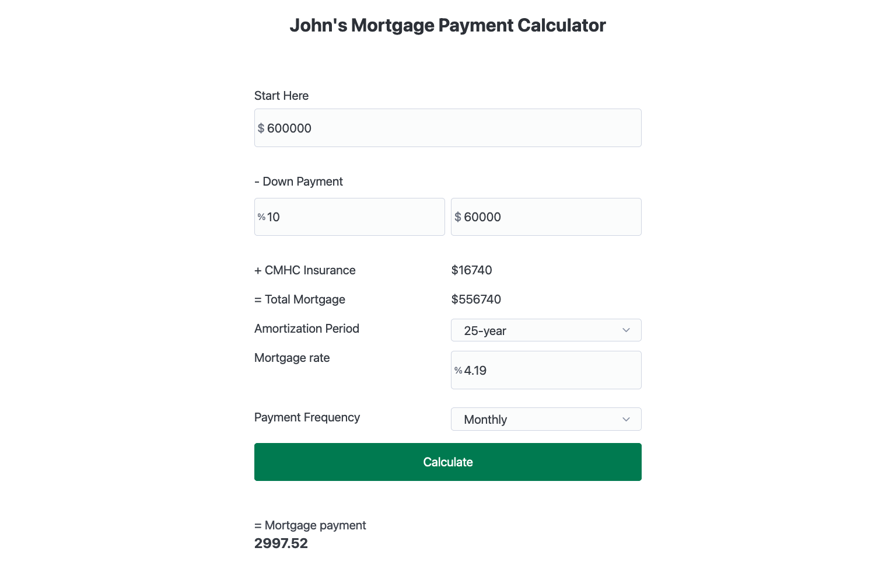

# Mortgage Calculator API

This project is a mortgage calculator API that you can use either through the provided UI or through an API request tool like Flashpost.

## Getting Started

### Installation

1. Clone the repository.
2. Navigate to the project folder.
3. Install dependencies using either `pnpm` or `npm`:

```bash
pnpm install
# or
npm install
```

### Running the Server

Start the server by running:

```bash
pnpm start
# or
npm start
```
The server will start on port 3001(http://localhost:3001/). The command line will provide a link to access the UI.
### Tailwind server

Start the tailwind by running:

```bash
pnpm tw
# or
npm tw
```
### Running the Test

Start the test by running:

```bash
pnpm test
# or
npm test
```
### API Usage

You can use the API with any tool you like (e.g., Flashpost, Postman) to (http://localhost:3001/api/mortgage) a POST request as application/json. The API accepts the following payload:

```json
{
    "propertyPrice": 600000,
    "downPayment": 60000,
    "annualInterestRate": 4.49,
    "amortizationPeriod": 25,
    "paymentSchedule": "Monthly"
}
```
Input Ranges and Values:

-	propertyPrice: Positive number (e.g., 600000).
-	downPayment: Positive number. This can either be the dollar amount or a percentage of the property price.
-	annualInterestRate: Number greater than 0.01.
-	amortizationPeriod: One of the following values: 5, 10, 15, 20, 25, 30.
-	paymentSchedule: One of the following values: "Monthly", "Bi-weekly", "Accelerated bi-weekly".


